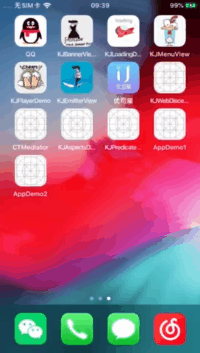

# KJSchemesDemo
一款App之间跳转相关的工具  
<p align="left">
  
</p>

----------------------------------------
### 框架整体介绍
* [作者信息](#作者信息)
* [作者其他库](#作者其他库)
* [流程介绍](#流程介绍)
* [方法介绍](#方法介绍)
* [使用方法](#使用方法)

#### <a id="作者信息"></a>作者信息
> Github地址：https://github.com/yangKJ  
> 简书地址：https://www.jianshu.com/u/c84c00476ab6  
> 博客地址：https://blog.csdn.net/qq_34534179  

#### <a id="作者其他库"></a>作者其他Pod库
```
播放器 - KJPlayer是一款视频播放器，AVPlayer的封装，继承UIView
pod 'KJPlayer'  # 播放器功能区
pod 'KJPlayer/KJPlayerView'  # 自带展示界面

实用又方便的Category和一些自定义控件
pod 'KJEmitterView'
pod 'KJEmitterView/Function'#
pod 'KJEmitterView/Control' # 自定义控件

轮播图 - 支持缩放 多种pagecontrol 支持继承自定义样式 自带网络加载和缓存
pod 'KJBannerView'  # 轮播图，网络图片加载

菜单控件 - 下拉控件 选择控件
pod 'KJMenuView' # 菜单控件

加载Loading - 多种样式供选择
pod 'KJLoadingAnimation' # 加载控件

```

##### Issue
如果您在使用中有好的需求及建议，或者遇到什么bug，欢迎随时issue，我会及时的回复，有空也会不断优化更新这些库

#### <a id="流程介绍"></a>流程介绍

####1.在AppDemo2的info.plist当中URL Schemes注册 URL
```
<key>CFBundleURLTypes</key>
<array>
	<dict>
	    <key>CFBundleURLSchemes</key>
	    <array>
	        <string>AppDemo2</string>
	    </array>
	</dict>
</array>
```
####2.AppDemo1添加白名单 LSApplicationQueriesSchemes - AppDemo2注册的 URL
```
<key>LSApplicationQueriesSchemes</key>
<array>
    <string>AppDemo2</string>
</array>
```
####3.AppDemo1调用方法kj_schemesWithLSApplicationQueriesSchemes
```
[KJSchemesTool kj_schemesWithLSApplicationQueriesSchemes:@"AppDemo2" AppID:@"12345" Parameter:@{@"xxx":@"123",@"A":@"a"}];
```
 
####4.在AppDemo2的AppDelegate当中实现该方法
```
/// 重写 openURL 方法
- (BOOL)application:(UIApplication *)app openURL:(NSURL *)url options:(NSDictionary<UIApplicationOpenURLOptionsKey,id> *)options{
    /// 打印收到的参数以及应用程序的 applicationkey
    NSLog(@"当前App被启动，下面是 跳转过来App 传递过来的 启动参数:\n%@",url.absoluteString);
    NSString *sourceApplication = options[UIApplicationOpenURLOptionsSourceApplicationKey];
    NSLog(@"sourceApplication:%@", sourceApplication);

    return YES;
}
```
> 备注：经测试传递的数据仅支持`字母和符号数字混合`

#### <a id="方法介绍"></a>方法介绍
```
/**跳转到指定应用程序
 
@param schemes 白名单 LSApplicationQueriesSchemes - AppDemo2注册的 URL
@param appid   AppID - AppDemo2对应的苹果商店id
@param parameter 需要传递的参数，接收方 xxx=123&A=a 接收样式如此
*/
+ (void)kj_schemesWithLSApplicationQueriesSchemes:(NSString*)schemes AppID:(NSString*)appid Parameter:(NSDictionary*)parameter;

```
#### <a id="使用方法"></a>使用方法
```
//// 用户 按下 按钮
- (IBAction)Btn1Click:(id)sender {
    [KJSchemesTool kj_schemesWithLSApplicationQueriesSchemes:@"AppDemo2" AppID:@"12345" Parameter:@{@"xxx":@"123",@"A":@"a"}];
}
```
#####AppDelegate.m接收外部App传递过来的数据
```
/// 重写 openURL 方法
- (BOOL)application:(UIApplication *)app openURL:(NSURL *)url options:(NSDictionary<UIApplicationOpenURLOptionsKey,id> *)options{
    /// 打印收到的参数以及应用程序的 applicationkey
    NSLog(@"当前App被启动，下面是 跳转过来App 传递过来的 启动参数:\n%@",url.absoluteString);
    NSString *sourceApplication = options[UIApplicationOpenURLOptionsSourceApplicationKey];
    NSLog(@"sourceApplication:%@", sourceApplication);

    ViewController *vc = (ViewController*)self.window.rootViewController;
    vc.view.backgroundColor = UIColor.blueColor;
    vc.label.text = url.absoluteString;
    return YES;
}
```
